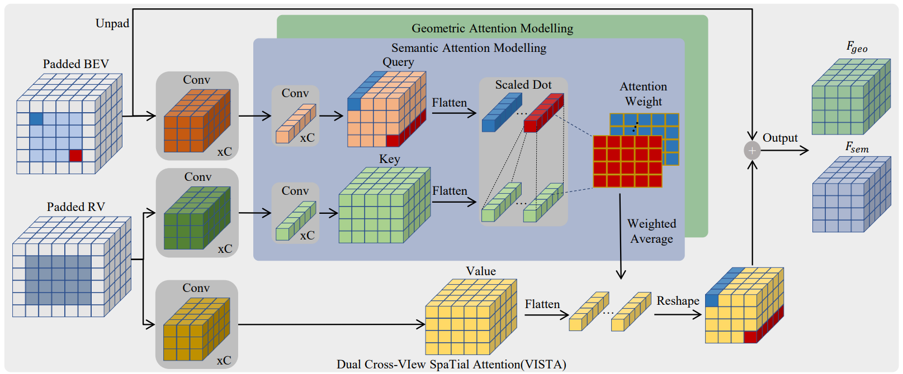

# VISTA


<p align="center"> VISTA: Boosting 3D Object Detection via Dual Cross-VIew SpaTial Attention </p> 
<p align="center"> Shengheng Deng, Zhihao Liang, Lin Sun and Kui Jia* </p>

<p align="right">(*) Corresponding author </p>

## Introduction

Detecting objects from LiDAR point clouds is of tremendous significance in autonomous driving. In spite of good progress, accurate and reliable 3D detection is yet to be achieved due to the sparsity and irregularity of LiDAR point clouds. Among existing strategies, multi-view methods have shown great promise by leveraging the more comprehensive information from both bird's eye view (BEV) and range view (RV). These multi-view methods either refine the proposals predicted from single view via fused features, or fuse the features without considering the global spatial context; their performance is limited consequently. In this paper, we propose to adaptively fuse multi-view features in a global spatial context via Dual Cross-VIew SpaTial Attention (VISTA). The proposed VISTA is a novel plug-and-play fusion module, wherein the multi-layer perceptron widely adopted in standard attention modules is replaced with a convolutional one. Thanks to the learned attention mechanism, VISTA can produce fused features of high quality for prediction of proposals. We decouple the classification and regression tasks in VISTA, and an additional constraint of attention variance is applied that enables the attention module to focus on specific targets instead of generic points. [[arxiv](https://arxiv.org/abs/2203.09704)]

## Requirements

- Linux
- Python 3.7+ (Tested on 3.7)
- PyTorch 1.8 or higher (Tested on 1.8.1)
- CUDA 11.1 or higher (Tested on 11.1)
- spconv 2.0+

### Notes

- Spconv should be the exact same version we provide in the instruction down below

- Nuscenes-Devkit should be the exact same version we provide in the instruction down below

## Installation


**Make sure your gpu driver and system environment support the pytorch version**

```
conda create --name vista python=3.7
conda activate vista
pip install torch==1.8.1+cu111 torchvision==0.9.1+cu111 torchaudio==0.8.1 -f https://download.pytorch.org/whl/torch_stable.html

git clone https://github.com/Gorilla-Lab-SCUT/VISTA.git

pip install -r requirements.txt

python setup.py build develop
```

### Spconv
Please refer to [spconv](https://github.com/traveller59/spconv) for detailed installation instructions

In our cases, we follow the command down below to install the latest spconv 2.0 which is faster and lighter than spconv 1.0, and is easier to install

```
pip install spconv-cu111
```

**NOTE** You need to install the spconv according to your current CUDA version!

### Nuscenes-Devkit

```
git clone https://github.com/AndlollipopDE/nuscenes.git
cd nuscenes
pip install -r requirements.txt
python setup.py install
```

## Data Preparation

Download the nuscenes data and organise as follows

```
NUSCENES_TRAINVAL_DATASET_ROOT
       ├── samples       <-- key frames
       ├── sweeps        <-- frames without annotation
       ├── maps          <-- unused
       └── v1.0-trainval <-- metadata and annotations
NUSCENES_TEST_DATASET_ROOT
       ├── samples       <-- key frames
       ├── sweeps        <-- frames without annotation
       ├── maps          <-- unused
       └── v1.0-test     <-- metadata
```

Then run the following command to create data pkl for trainval set

```
python tools/create_data.py nuscenes_data_prep --root_path=NUSCENES_TRAINVAL_DATASET_ROOT --version="v1.0-trainval" --nsweeps=10
```

If you want to create data pkl for test set:

```
python tools/create_data.py nuscenes_data_prep_test --root_path=NUSCENES_TEST_DATASET_ROOT --nsweeps=10
```

## Training

We provide the [configurations](configs/vista/vista.py). Please modify the **data path** and **batch size** accordingly

To train the VISTA, please run the following command, note that you should modify the workdir path and CUDA GPU Number in the [script](tools/scripts/train.sh)

```
./tools/scripts/train.sh experiment_description configuration_path
```

To resume a training, run

```
./tools/scripts/train.sh experiment_description configuration_path resume_checkpoint_path
```

## Evaluation and Testing

To evaluate the VISTA on the validation set, simply run
```
./tools/scripts/test.sh configuration_path work_dir workdir/checkpoint.pth
```

To test the VISTA on the test set, please enable the test flag in [test.sh](tools/scripts/test.sh) and replace the testing pkl path in [dist_test.py](tools/dist_test.py)

## Pretrained model

We provide a pretrained model trained on the nuScenes dataset, the configuration is exactly the [one](configs/vista/vista.py) we provide. The pretrained model can be downloaded from [Google Drive](https://drive.google.com/file/d/1JaFO6TFwQOZbC_UFRGAkH_4CB3Uuh6o-/view?usp=sharing). The performances of the pretrained model on validation set of nuScenes are presented down below (Double Flip Enabled).

|       mAP       |      NDS      |     Car AP    |  Truck AP  |      Bus AP     | Trailer AP |
|:---------------:|:-------------:|:-------------:|:----------:|:---------------:|:----------:|
|      62.83      |     69.52     |     85.93     |    60.73   |      68.40      |    41.42   |
| **Cons Vehicle AP** | **Pedestrian AP** | **Motorcycle AP** | **Bicycle AP** | **Traffic Cone AP** | **Barrier AP** |
|      23.50      |     85.40     |     70.20     |    55.53   |      71.47      |    65.84   |

## Acknowlegement

This repo is built upon several opensourced codebases, shout out to them for their amazing works.

- [det3D](https://github.com/poodarchu/Det3D)
- [CenterPoint](https://github.com/tianweiy/CenterPoint)
- [second.pytorch](https://github.com/traveller59/second.pytorch)
- [mmcv](https://github.com/open-mmlab/mmcv)
- [mmdetection](https://github.com/open-mmlab/mmdetection)
- [OpenPCDet](https://github.com/open-mmlab/OpenPCDet)
- [spconv](https://github.com/traveller59/spconv)

## Citation

If you find this work useful in your research, please cite
```
@inproceedings{deng2022vista,
  title={VISTA: Boosting 3D Object Detection via Dual Cross-VIew SpaTial Attention},
  author={Deng, Shengheng and Liang, Zhihao and Sun, Lin and Jia, Kui},
  booktitle={Proceedings of the IEEE Conference on Computer Vision and Pattern Recognition},
  year={2022}
}
```
# Bugs

If you find any bugs in this repo, please let me know!
